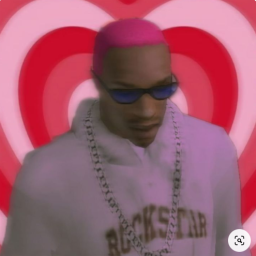
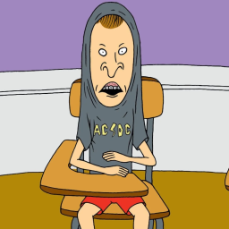

# Meet the Staff

Welcome to the official **Revolt Roleplay Team** page.  
Here you can meet the people who develop, manage and protect the world of RRP.

---

## Founders

  

    
    <h3>Hudson</h3>
    
<strong>Founder</strong>

    
Visionary behind RRP. Oversees direction, community growth and server decisions.

  

  

    
    <h3>Zekiloni</h3>
    
<strong>Founder & Developer</strong>

    
Visionary behind RRP. Lead developer. Builds systems, maintains server stability and introduces new features.

  

---

## Management

  

    
    <h3>Vacant</h3>
    
<strong>Management</strong>

    
Position vacant.

  

---

## Administrators

  

    
    <h3>Marshall</h3>
    
<strong>Lead Admin</strong>

    
Oversees and leads RRP administration. Responsible for all changes and admins.

  

---

## Testers

  

    
    <h3>Vacant</h3>
    
<strong>Tester</strong>

    
Position vacant.

  

---

## Support & Other Roles

  

    
    <h3>Vacant</h3>
    
<strong>Discord Moderator</strong>

    
Position vacant.

  

---

## Want to Join the Staff?

Interested in becoming part of the team?

- Apply on UCP
- Have a clean admin record and good reputation
- Know the rules and server standards
- Be mature, calm and respectful  
