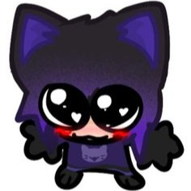

# Meet the Staff

Welcome to the official **Revolt Roleplay Team** page.  
Here you can meet the people who develop, manage and protect the world of RRP.

---

## Founders

  

    
    <h3>Hudson</h3>
    
<strong>Founder</strong>

    
Visionary behind RRP. Oversees direction, community growth and server decisions.

  

  

    
    <h3>Zekiloni</h3>
    
<strong>Founder & Developer</strong>

    
Lead developer. Builds systems, maintains server stability and introduces new features.

  

---

## Management

  

    
    <h3>ExampleName</h3>
    
<strong>Staff Manager</strong>

    
Coordinates staff team and handles staff applications.

  

  

    
    <h3>ExampleName</h3>
    
<strong>Community Manager</strong>

    
Ensures a positive and welcoming environment for all players.

  

---

## Administrators

  

    
    <h3>ExampleName</h3>
    
<strong>Senior Admin</strong>

    
Handles reports, bans and high-level moderation situations.

  

  

    
    <h3>ExampleName</h3>
    
<strong>Admin</strong>

    
Monitors in-game activity and supports players during issues.

  

  

    
    <h3>ExampleName</h3>
    
<strong>Admin</strong>

    
Monitors in-game activity and supports players during issues.

  

  

    
    <h3>ExampleName</h3>
    
<strong>Admin</strong>

    
Monitors in-game activity and supports players during issues.

  

  

    
    <h3>ExampleName</h3>
    
<strong>Admin</strong>

    
Monitors in-game activity and supports players during issues.

  

  

    
    <h3>ExampleName</h3>
    
<strong>Admin</strong>

    
Monitors in-game activity and supports players during issues.

  

  

    
    <h3>ExampleName</h3>
    
<strong>Admin</strong>

    
Monitors in-game activity and supports players during issues.

  

---

## Testers

  

    
    <h3>ExampleName</h3>
    
<strong>Head Tester</strong>

    
Finds bugs and ensures updates are stable before release.

  

  

    
    <h3>ExampleName</h3>
    
<strong>Head Tester</strong>

    
Finds bugs and ensures updates are stable before release.

  

  

    
    <h3>ExampleName</h3>
    
<strong>Head Tester</strong>

    
Finds bugs and ensures updates are stable before release.

  

  

    
    <h3>ExampleName</h3>
    
<strong>Head Tester</strong>

    
Finds bugs and ensures updates are stable before release.

  

  

    
    <h3>ExampleName</h3>
    
<strong>Head Tester</strong>

    
Finds bugs and ensures updates are stable before release.

  

  

    
    <h3>ExampleName</h3>
    
<strong>Head Tester</strong>

    
Finds bugs and ensures updates are stable before release.

  

  

    
    <h3>ExampleName</h3>
    
<strong>Head Tester</strong>

    
Finds bugs and ensures updates are stable before release.

  

---

## Support & Other Roles

  

    
    <h3>ExampleName</h3>
    
<strong>Discord Moderator</strong>

    
Moderates Discord channels and assists community members.

  

  

    
    <h3>ExampleName</h3>
    
<strong>Graphic Designer</strong>

    
Creates server artwork, banners, and visual branding.

  

---

## Want to Join the Staff?

Interested in becoming part of the team?

- Apply on UCP
- Have a clean admin record and good reputation
- Know the rules and server standards
- Be mature, calm and respectful  
